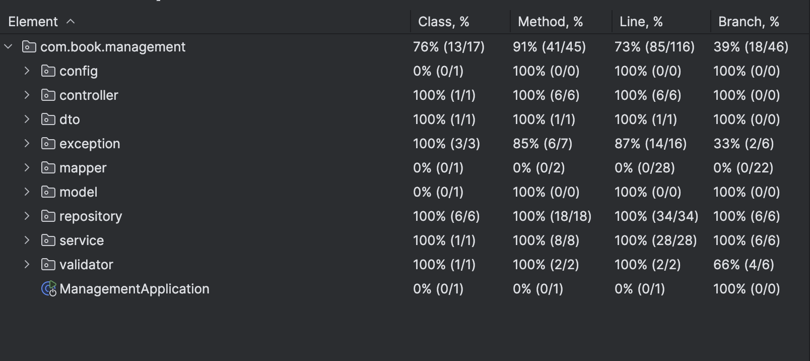

# Book Management API

This is a RESTful API for managing a collection of books. It allows users to create, read, update, 
and delete books, as well as search for books based on various parameters.


## Features
- Create, read, update, and delete books
- Search books by different parameters (e.g., title, author, genre)
- Swagger UI for API documentation and testing

## Technologies Used

- Java 21
- Maven
- Spring Boot
- Spring Data JPA
- H2 Database
- MapStruct
- Swagger
- JUnit
- Mockito
- Lombok
- Hibernate Validator

## Endpoints

### 1. Create a new book
**POST** `/api/books`  
Creates a new book with the provided details.

**Request Example:**
```json
{
  "title": "Kobzar",
  "author": "Taras Shevchenko",
  "publicationYear": 1840,
  "genre": "Poetry",
  "isbn": "978-966-1650-77-9"
}
```

### 2. Get a book by ID
**GET** `/api/books/{id}`  
Returns details of a specific book by its ID.

**Response Example:**
```json
{
  "id": 1,
  "title": "Kobzar",
  "author": "Taras Shevchenko",
  "publicationYear": 1840,
  "genre": "Poetry",
  "isbn": "978-966-1650-77-9"
}
```

### 3. Update a book by ID
**PUT** `/api/books/{id}`  
Updates details of an existing book by its ID.

**Request Example:**
```json
{
  "title": "Kobzar",
  "author": "Taras Shevchenko",
  "publicationYear": 1840,
  "genre": "Poetry",
  "isbn": "978-966-1650-77-9"
}
```

### 4. Search Books
**GET** `/api/books/search`
Searches for books based on provided parameters (e.g., title, author, genre).

**Request Example:**
```json
{
  "title": "Kobzar",
  "author": "Taras Shevchenko",
  "publicationYear": 1840,
  "genre": "Poetry",
  "isbn": "978-966-1650-77-9"
}
```

### 5. Get all books
**GET** `/api/books`  
Retrieves a list of all books.

**Response Example:**
```json
[
  {
    "id": 1,
    "title": "Kobzar",
    "author": "Taras Shevchenko",
    "publicationYear": 1840,
    "genre": "Poetry",
    "isbn": "978-1-1516-4732-0"
  },
  {
    "id": 2,
    "title": "Earth",
    "author": "Olha Kobylianska",
    "publicationYear": 1902,
    "genre": "Novel",
    "isbn": "978-7-3664-5711-2"
  }
]
```
### 6. Delete a book by ID
**DELETE** `/api/books/{id}`  
Deletes a book by its ID.

## Code Coverage


